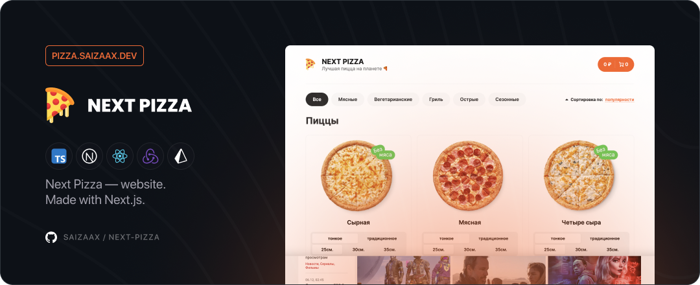

# Next Pizza — Website 🍕

[](https://pizza.saizaax.dev/)
[](https://nextjs.org/)
[](https://reactjs.org/)
[](https://redux.js.org/)
[](https://www.typescriptlang.org/)
[](https://www.docker.com/)
[](https://github.com/features/actions)



<h3 align="center">
✨ Preview • <a href="https://pizza.saizaax.dev/">pizza.saizaax.dev</a>
</h3>

## Technologies

### Frontend
- `React.js`
- `TypeScript`
- `SCSS`
- `Axios`
- `Lodash`

### Backend
- `Next.js`
- `MySQL`
- `Prisma`

<br>

## How to run locally

* Download & Install [Node.js](https://nodejs.org/en/)

* Clone this repository
    ```bash
    git clone https://github.com/saizaax/next-pizza
    ```

* Open terminal and navigate to repository directory
    ```bash
    cd next-pizza
    ```

* Add `.env` file to root directory
    ```bash
    # Client-Side API URL
    NEXT_PUBLIC_API_URL='http://localhost:3000/api'

    # Database URL
    DATABASE_URL='mysql://database/next-pizza'
    ```

* Install npm dependencies 
    ```bash
    npm i
    ```

* Generate Prisma Client (make sure your database is up)
    ```bash
    npx prisma generate
    ```

* Run with npm 
    ```bash
    npm run dev
    ```

* Open in web-browser
    ```bash
    http://localhost:3000/
    ```

<br>

## How to run in Docker

* Download & Install [Docker / Docker Desktop](https://www.docker.com/products/docker-desktop)

* Clone this repository
    ```bash
    git clone https://github.com/saizaax/next-pizza
    ```

* Open terminal and navigate to repository directory
    ```bash
    cd next-pizza
    ```

* Add `.env` file to root directory / Edit `docker-compose.yml` environment variables
    ```bash
    # Client-Side API URL
    NEXT_PUBLIC_API_URL='http://localhost:3000/api'

    # Database URL
    DATABASE_URL='mysql://database/next-pizza'
    ```

* Run docker-compose 
    ```bash
    docker-compose up --build --detach
    ```

* Open in web-browser
    ```bash
    http://localhost:3000/
    ```

<br>

## Contacts

2022 • Korolkov Alexander • [@saizaax](https://t.me/saizaax) • [saizaax.off@gmail.com](mailto:saizaax.off@gmail.com)